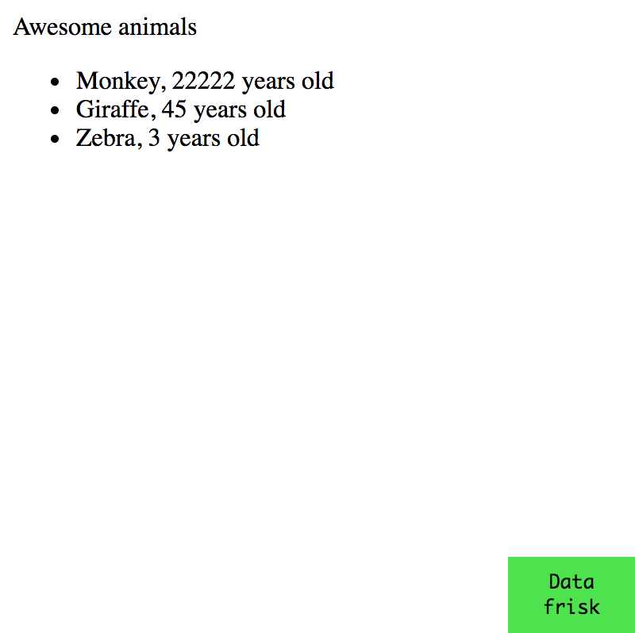

# data-frisk-reagent

> "Get your facts first, then you can distort them as you please" - Mark Twain

Visualize your data in your Reagent apps as a tree structure.

Suitable for use during development.



## Install


Add `data-frisk-reagent` to the dev `:dependencies` in your `project.clj`

## Usage

This library's public API consists of two reagent components: `datafrisk.core/DataFriskShell` and `datafrisk.core/DataFriskView`.


### DataFriskShell

This is what you see in the animation above. The component renders as a single data navigation "shell" fixed to the bottom of the window. 
It can be expanded/hidden via a toggle at the bottom right hand corner of the screen. 

Example:

```clojure
(ns datafrisk.demo
  (:require [reagent.core :as r]
            [datafrisk.core :as d]))

(defn mount-root []
  (r/render
    [d/DataFriskShell
     ;; List of arguments you want to visualize
     {:data {:some-string "a"
             :vector-with-map [1 2 3 3 {:a "a" :b "b"}]
             :a-set #{1 2 3}
             :a-map {:x "x" :y "y" :z [1 2 3 4]}
             :a-list '(1 2 3)
             :a-seq (seq [1 2])
             :an-object (clj->js {:a "a"})
             :this-is-a-very-long-keyword :g}}
     {:a :b :c :d}]
    (js/document.getElementById "app")))
```

### DataFriskView

This component lets you dig in to any data structure. Here's an example of its use:


```clojure
(ns datafrisk.demo
  (:require [reagent.core :as r]
            [datafrisk.core :as d]))

(def app-state {:animals [{:species "Giraffe" :age 10} 
                          {:species "Rhino" :age 4} 
                          {:species "Monkey" :age 4}]})

(defn AnimalSalute [animal]
  [:div 
    (str "Hi " (:species animal) "!")
    [d/DataFriskView animal]])

(defn mount-root []
  (r/render
    [:div
     (for [animal (:animals app-state)]
       [AnimalSalute animal])]
    (js/document.getElementById "app")))
```

### Re-frame

See the [re-frisk](https://github.com/flexsurfer/re-frisk) project.

### For more

See the dev/demo.cljs namespace for example use.

## License

Copyright © 2017 Odin Standal

Distributed under the MIT License (MIT)