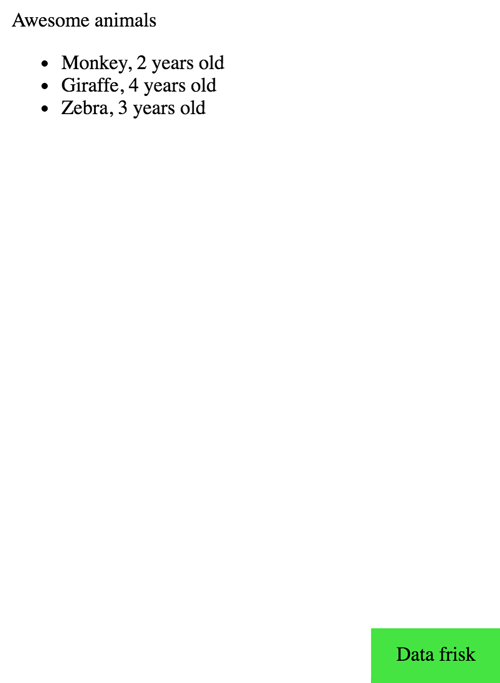

# data-frisk-reagent

> "Get your facts first, then you can distort them as you please" - Mark Twain

Visualize your data in your Reagent apps as a tree structure.

Suitable for use during development.



## Install

Add `[data-frisk-reagent "0.2.1"]` to the dev `:dependencies` in your `project.clj`

## Usage

```clojure
(ns datafrisk.demo
  (:require [reagent.core :as r]
            [datafrisk.core :as d]))

(defn mount-root []
  (r/render
    [d/DataFriskShell
     ;; List of arguments you want to visualize
     {:data {:some-string "a"
             :vector-with-map [1 2 3 3 {:a "a" :b "b"}]
             :a-set #{1 2 3}
             :a-map {:x "x" :y "y" :z [1 2 3 4]}
             :a-list '(1 2 3)
             :a-seq (seq [1 2])
             :an-object (clj->js {:a "a"})
             :this-is-a-very-long-keyword :g}}
     {:a :b :c :d}]
    (js/document.getElementById "app")))
```

See the dev/demo.cljs namespace for usage

## License

Copyright © 2016 Odin Standal

Distributed under the MIT License (MIT)